# hackathonbtg-agrobill

Contexto:

https://home.hackathonbtg.com/

## Squad AgroBill!

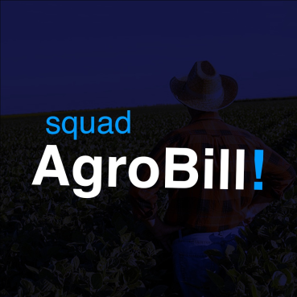

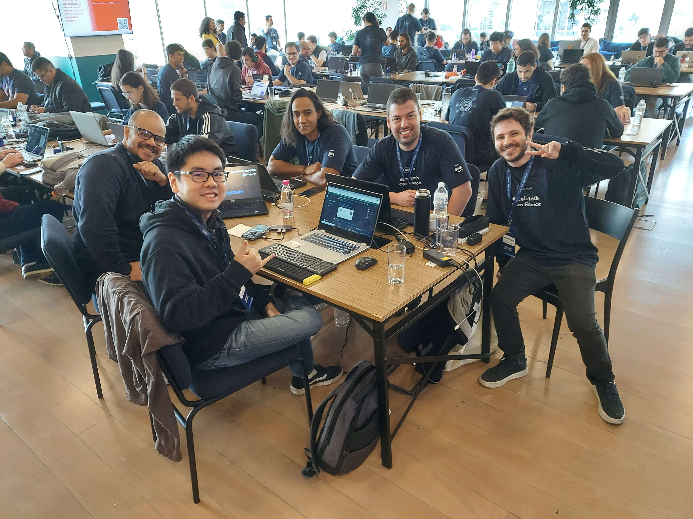

### Membros

Mentor: Rennan Gaio (https://www.linkedin.com/in/rennangaio)

* EiÁlex
    * https://www.linkedin.com/in/eialex/
* Carlos
    * https://www.linkedin.com/in/carlos-aguni/
* Diego
    * https://www.linkedin.com/in/diegoolivers
* Francisco Nardi
    * https://www.linkedin.com/in/francisnardi/

## Estrutura do Repositório

* `wkdir-jupyter`: Notebooks para pré exploração de dados dos dumps do OpenFinance
    * `agro_insights.ipyng`: Merge criação da tabela `agro_insights` à partir das "tabelas". Salva resultados em `sqlite` e `pkl`.:
        `financings-contracts`
        `financings-details`
        `financings-warranties`
        `financings-payments`
        `financings-scheduled-instalments`
    * `dbuml.ipynb`: Criar estrutura UML para desenho https://dbdiagram.io/d
    * `postgre.ipynb`: Salvar tabela `agro_insights` no RDS postgresql
* `wkdir-frontend`: VueJS Frontend da Solução

## Arquitetura de Solução

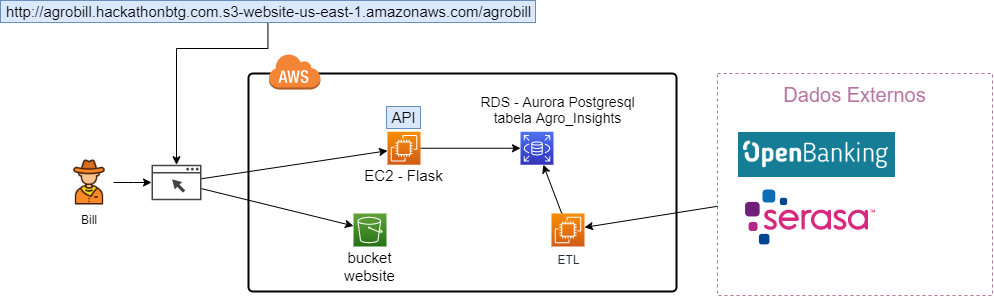

RDS contém tabela `Agro_Insights` descrita abaixo.  
Serasa não foi coletada no projeto mas foi considerado seu dado (mock) no sistema.

## ETL Dados OpenFinance

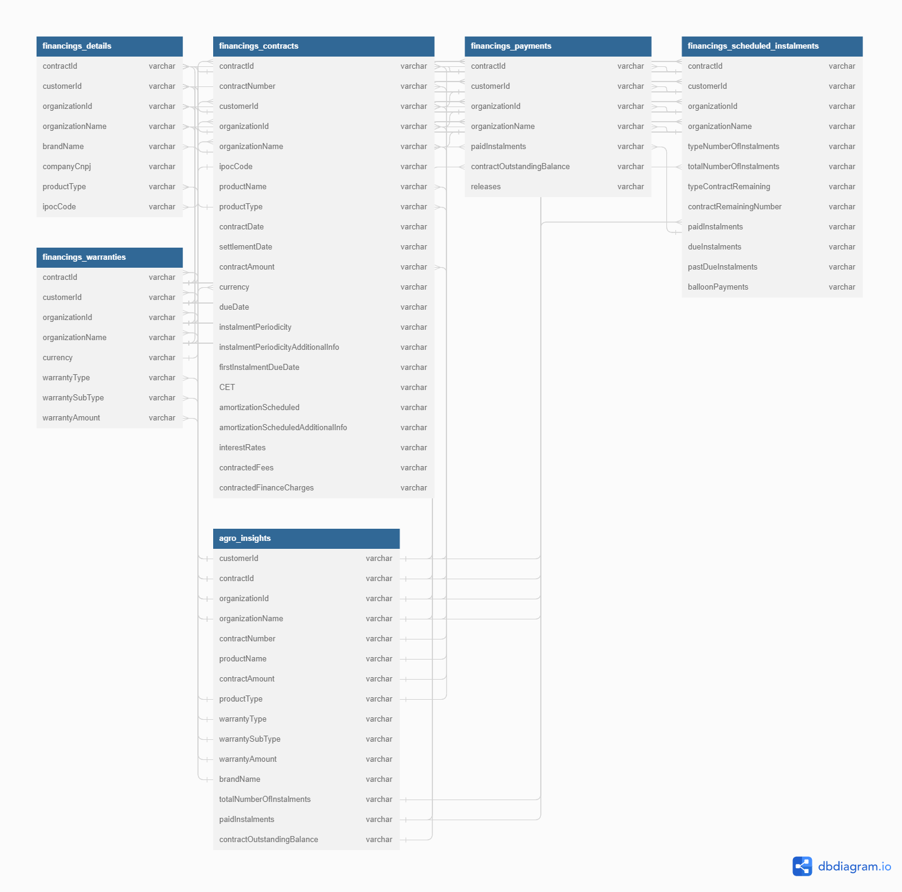

## Demo

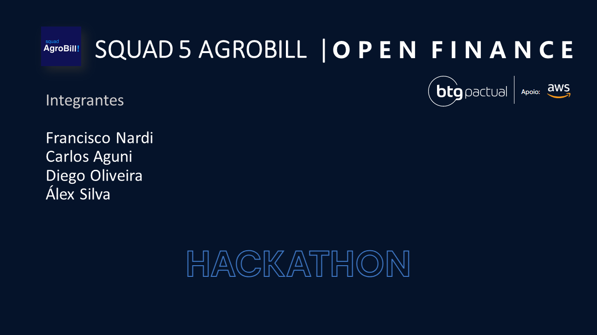
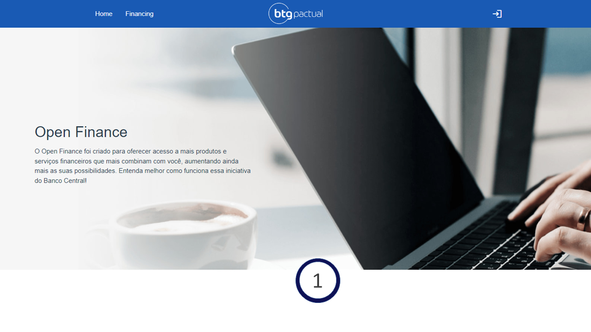
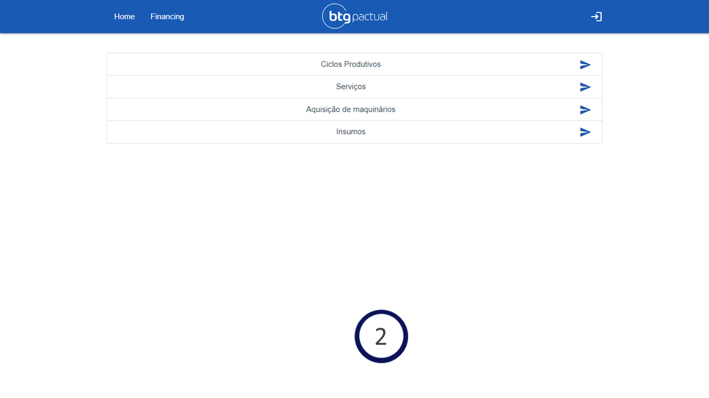
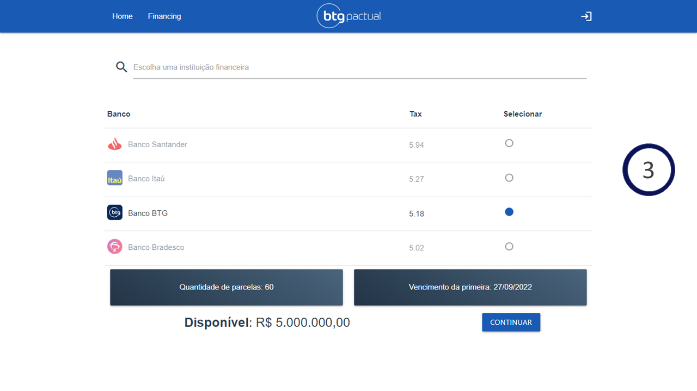
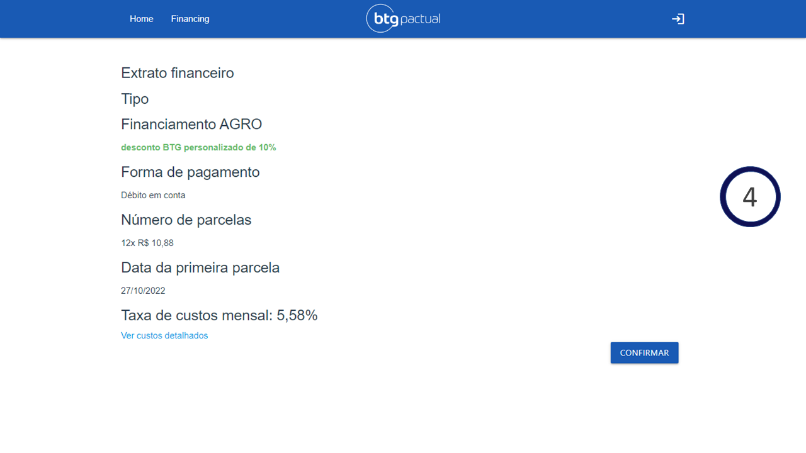
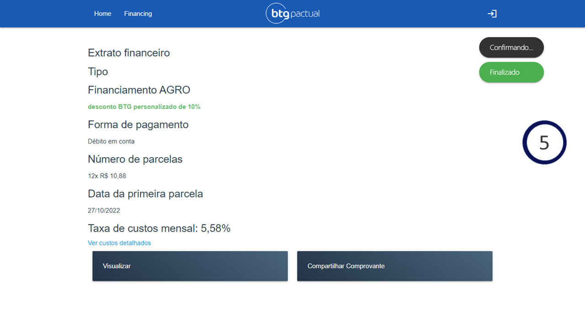
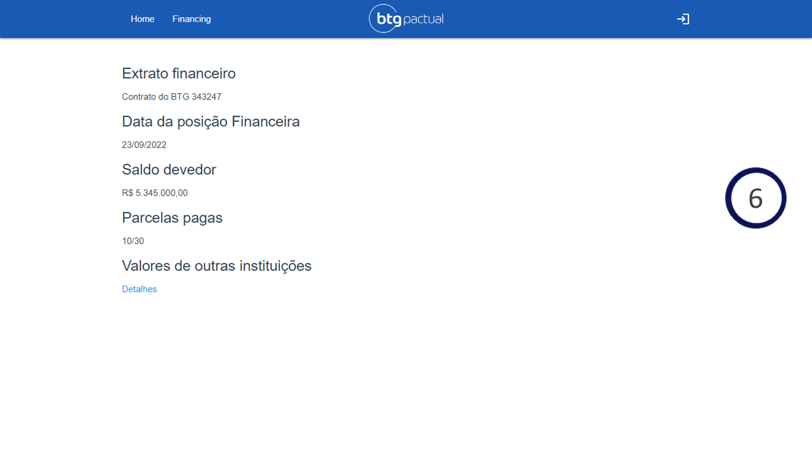
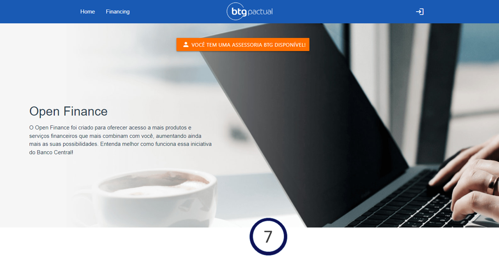
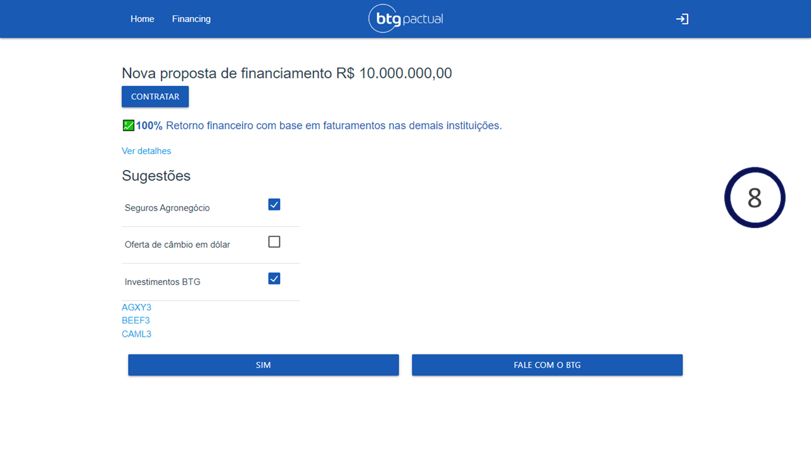

