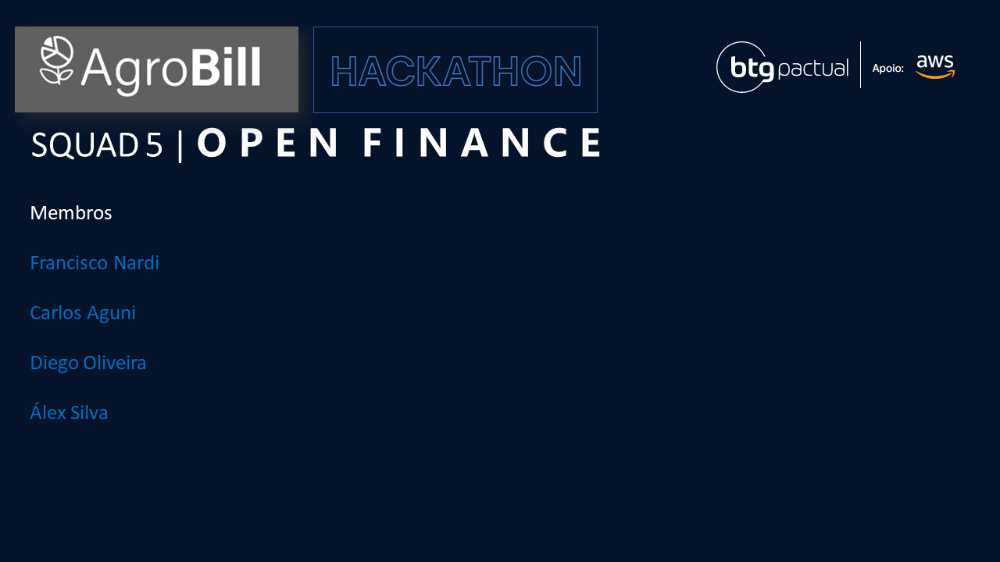

# hackathonbtg-agrobill

Contexto:

https://home.hackathonbtg.com/

## Squad AgroBill!

### Membros

Mentor: Rennan Gaio

* EiÁlex
    * https://www.linkedin.com/in/eialex/
* Carlos
    * https://www.linkedin.com/in/carlos-aguni/
* Diego
    * https://www.linkedin.com/in/diegoolivers
* Francisco Nardi
    * https://www.linkedin.com/in/francisnardi/

## Solução

RDS contém tabela `Agro_Insights` descrita abaixo.  
Serasa não foi coletada no projeto mas foi considerado seu dado (mock) no sistema.

## ETL Dados OpenFinance

## Demo

